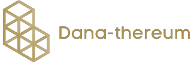

  

<h1 align="center">Dana-thereum (Blockchain Application in Fundraising)</h1>

Dana-Thereum is a fund-raising web application. It is a new way of creating fundraising campaigns and donations that applied blockchain technology. 

### Features

1. An organizer can create campaign for fundraising, create a request to withdraw money and finalize the request of withdrawal.
2. A donor can donate money to the campaign and approve or reject request from organizer.

### Tools used

1. Node
2. Next-js
3. Semantic-ui-react
4. Web3
5. MetaMask

### Run and interact with the project locally

Type the following in the command line / terminal

1. To clone this project: `git clone https://github.com/megatheikal/Dana-thereum.git`
2. `cd Dana-thereum`
3. To install app dependencies: `npm install`
4. To start and launch project: `npm run dev`

### Testing the contracts locally

1. To run a local blockchain to test the contracts: `truffle develop`
2. To compile, in the truffle console type: `compile`
3. To migrate the contracts on the blockchain: `migrate`. Use `migrate --reset` in case of error.
4. To test, type: `test`

### Author

[Megat Heikal](https://github.com/megatheikal)

